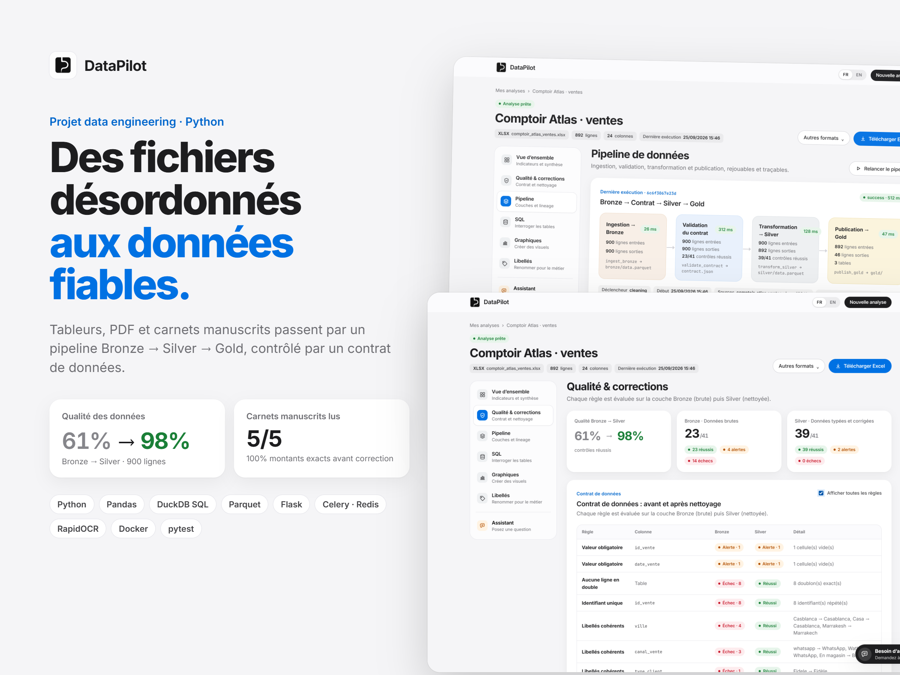
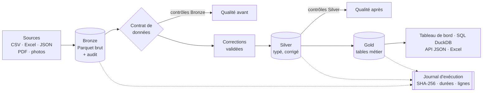
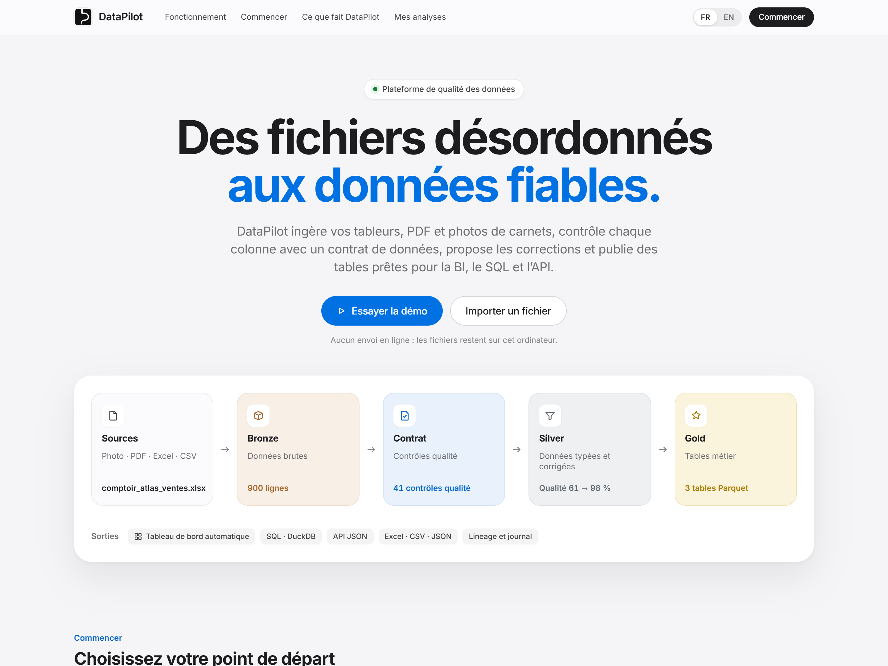
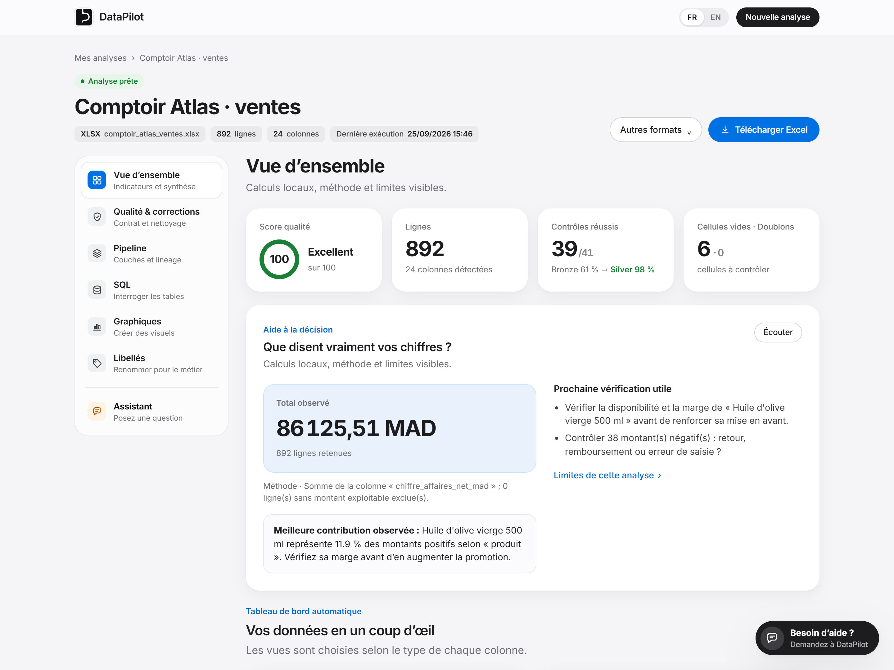
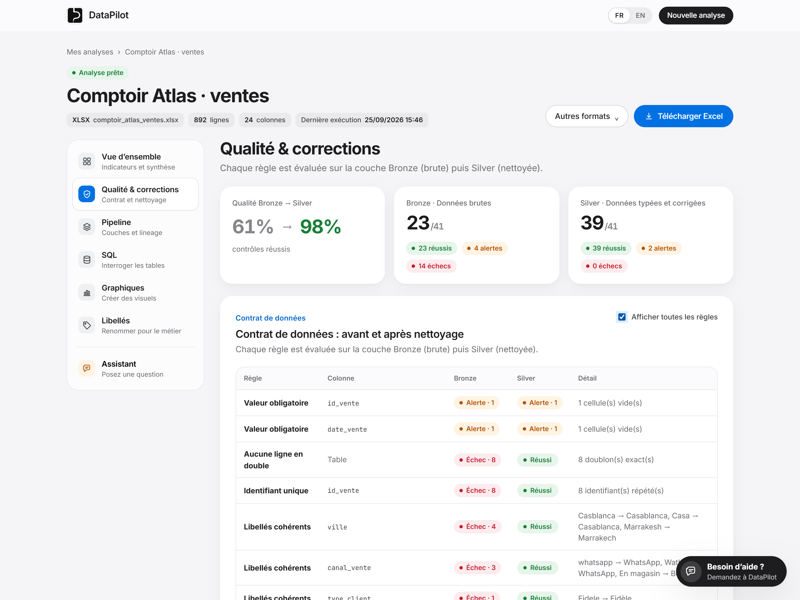
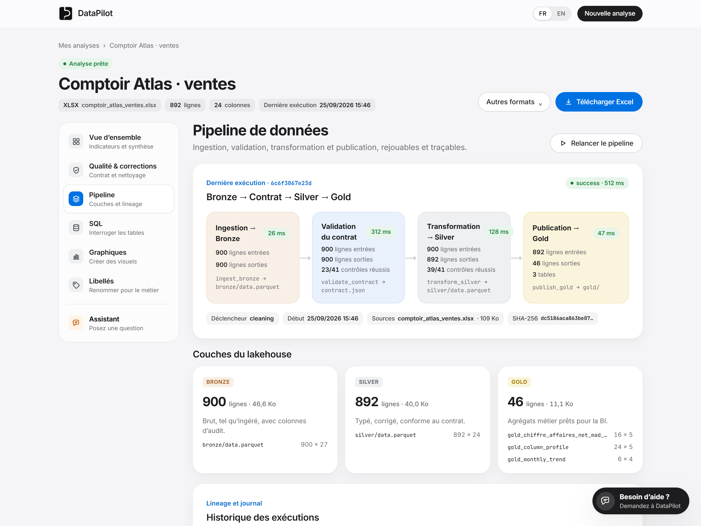
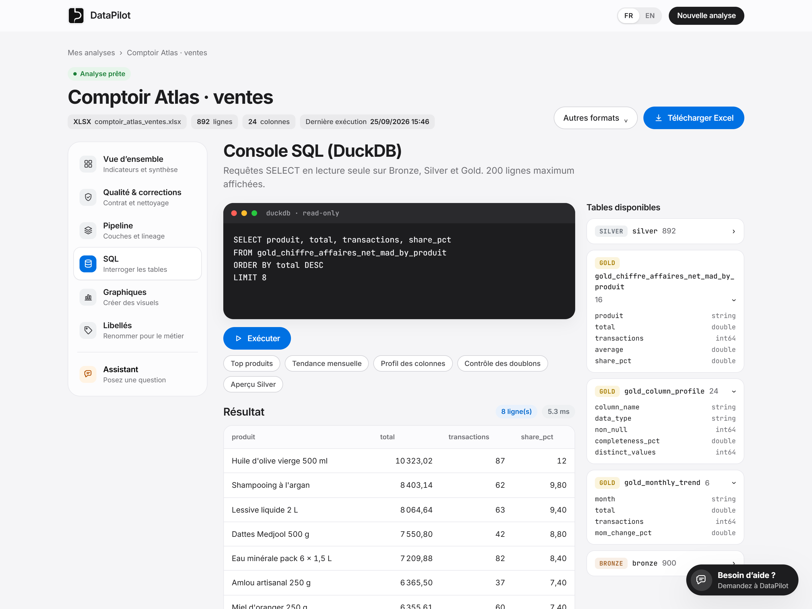
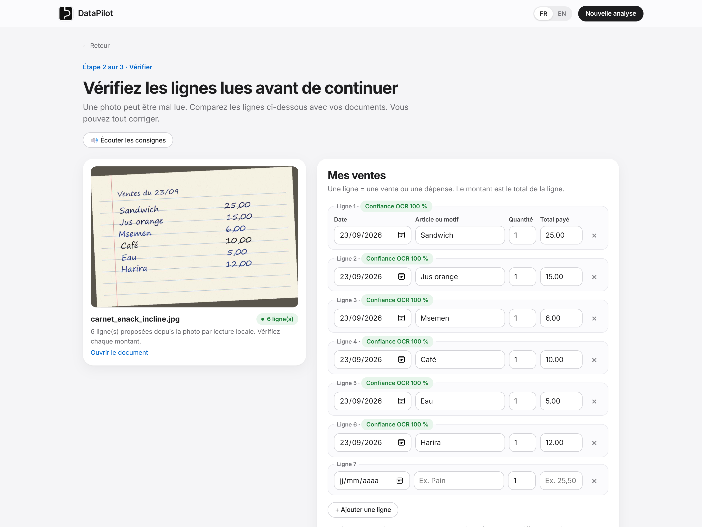

# DataPilot

**Des fichiers désordonnés aux données fiables.** DataPilot ingère des tableurs, des PDF et des photos de carnets manuscrits, contrôle chaque colonne avec un contrat de données, propose des corrections validées par l'utilisateur et publie des tables prêtes pour la BI, le SQL et une API JSON. Interface bilingue français / anglais.



> **Stack :** Python, Pandas, DuckDB, Parquet (pyarrow), Flask, Celery, Redis, RapidOCR, Docker, pytest, Playwright
> **Tests :** 149 tests automatisés + un essai de bout en bout mesuré sur des fichiers à vérité terrain connue
> **Portfolio :** [abdou-salou.github.io](https://abdou-salou.github.io/fr)

## Ce que fait l'application

| Étape | Ce qui se passe | Où le voir |
|---|---|---|
| Ingestion | CSV, Excel, JSON, PDF, photos (jusqu'à 20 Mo). Le fichier brut est figé en **Bronze** (Parquet) avec colonnes d'audit (`_ingested_at`, `_source_file`, `_row_number`). | Pipeline |
| Contrat de données | Types, champs obligatoires, unicité, plages (ex. note ≤ 5, quantité ≥ 0), libellés cohérents : déduits de la sémantique des colonnes puis évalués à chaque exécution. | Qualité & corrections |
| Corrections | Doublons, espaces, libellés proches (« Casblanca » → « Casablanca »), montants incohérents, conversions de types. Rien n'est appliqué sans validation ; chaque étape est annulable. | Qualité & corrections |
| Silver et Gold | Silver = données typées et corrigées. Gold = tables métier (chiffre d'affaires par produit, tendance mensuelle, profil des colonnes). | Pipeline, Vue d'ensemble |
| Lineage | Chaque exécution est journalisée : empreinte SHA-256 du fichier, durée par étape, lignes entrées et sorties, qualité Bronze → Silver. | Pipeline |
| SQL | Console DuckDB en lecture seule sur Bronze, Silver et Gold (pas d'écriture, pas d'accès disque). | SQL |
| OCR | Carnets manuscrits et PDF scannés lus localement ; l'inclinaison de la photo est corrigée, chaque ligne affiche sa confiance OCR et doit être validée. | Photos et carnets |
| Restitution | Tableau de bord automatique, graphiques personnalisés, assistant local, exports Excel (protégés contre l'injection de formules), CSV, JSON, API. | Toutes les pages |



## Résultats mesurés

L'essai `demo/test_suite/run_e2e.py` fait passer chaque fichier par les vraies routes de l'application et compare le résultat à `ground_truth.json`. **Toutes les données sont fictives.** Les carnets sont écrits avec des polices manuscrites Windows, puis inclinés, floutés et compressés ; la dernière photo a été générée par IA.

| Fichier | Contenu | Résultat |
|---|---|---|
| `comptoir_atlas_ventes.xlsx` | 900 ventes, anomalies documentées (doublons, fautes de saisie, valeurs aberrantes, formats) | Qualité du contrat **61 % → 98 %**, 892 lignes en Silver, 3 tables Gold |
| `ventes_mensuelles_sales.csv` | 306 lignes, séparateur `;`, virgule décimale, anomalies injectées | Qualité **68 % → 87 %** ; les écarts restants (note hors échelle, quantités négatives) demandent une décision métier |
| `orders_en.json` | 121 commandes en anglais, JSON imbriqué | Qualité **78 % → 100 %** |
| 5 pages manuscrites (dont 1 PDF scanné, 2 photos inclinées) | 26 lignes de vente | **26/26 lignes retrouvées, 26/26 montants exacts**, totaux identiques, avant toute correction humaine |
| `facture_atlas.png` | Facture fournisseur | **7/7 champs** extraits (fournisseur, numéro, date, HT, TVA, TTC, devise) |

Détail complet : [RAPPORT_E2E.md](demo/test_suite/RAPPORT_E2E.md). Ces essais ont révélé deux défauts corrigés depuis : l'ordre de lecture OCR décalait les montants d'une ligne sur les photos inclinées, et les factures en image n'étaient lues que si Tesseract était installé.

## Captures

| | |
|---|---|
|  |  |
|  |  |
|  |  |

Version anglaise : [docs/screenshots/en](docs/screenshots/en). Les captures sont produites automatiquement par `demo/screenshots/capture.py` (Playwright).

## Lancer

```powershell
pip install -r requirements.txt
python app.py
```

Puis ouvrir `http://localhost:5071` et cliquer sur **Essayer la démo** (jeu Comptoir Atlas, 900 ventes). Le bouton FR / EN en haut à droite change la langue de toute l'interface.

Mode robuste avec file de tâches : démarrer Docker Desktop puis `lancer_datapilot_robuste.bat` (Redis, worker Celery et application). Si Redis ne répond pas, l'analyse se fait dans le processus web.

## API JSON

| Route | Contenu |
|---|---|
| `GET /api/v1/projects/<id>/tables/<table>?limit=&offset=` | Lignes d'une table (`bronze`, `silver`, `gold_*`), paginées |
| `GET /api/v1/projects/<id>/quality` | Résumé Bronze / Silver, détail des contrôles, contrat |
| `GET /api/v1/projects/<id>/runs` | Journal des exécutions (lineage) |

## Tests

```powershell
pip install -r requirements-dev.txt
pytest -q                                   # 149 tests
python demo/test_suite/generate_test_files.py
python demo/test_suite/run_e2e.py           # essai de bout en bout mesuré
```

## Architecture du code

| Module | Rôle |
|---|---|
| `pipeline.py` | Médaillon Bronze / Silver / Gold, contrat de données, contrôles, journal d'exécution, SQL DuckDB en lecture seule |
| `datapilot.py` | Lecture, profilage, suggestions et application des corrections, tableau de bord, assistant local |
| `ocr_layout.py` | Reconstruction des lignes OCR avec correction de l'inclinaison |
| `sales_capture.py`, `invoice_features.py` | Carnets, tickets, PDF scannés et factures, toujours soumis à validation humaine |
| `i18n.py` | Interface bilingue : catalogue exact et motifs pour les phrases générées |
| `app.py` | Routes Flask, API JSON, exports, sécurité (CSRF, accès réseau par code) |

## Limites

- Prototype local : pas d'authentification multi-utilisateur, ni d'hébergement de production.
- Le contrat est **inféré** : il propose des règles plausibles, que l'utilisateur doit valider dans un contexte réel.
- L'OCR a été mesuré sur des écritures simulées et une photo générée par IA, pas sur de vrais carnets de commerçants.
- Un montant total n'est pas un bénéfice : sans coûts, l'application refuse de calculer une marge.
