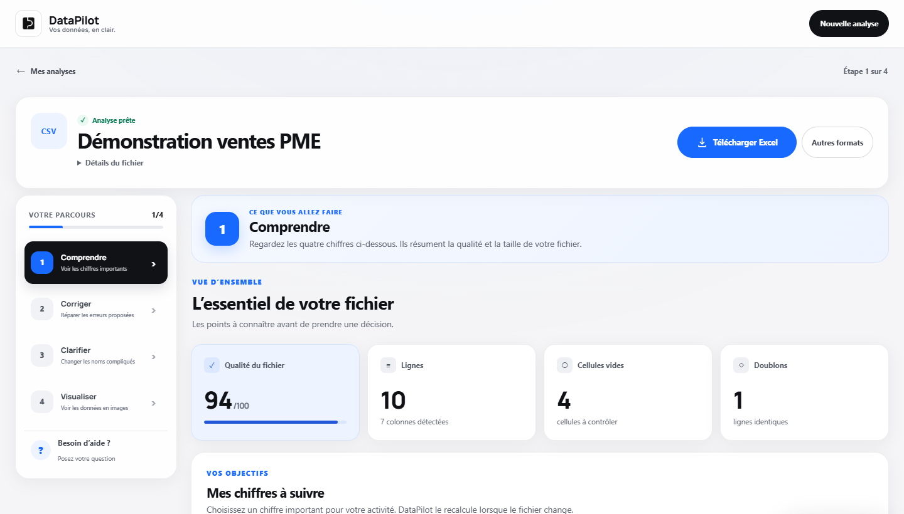
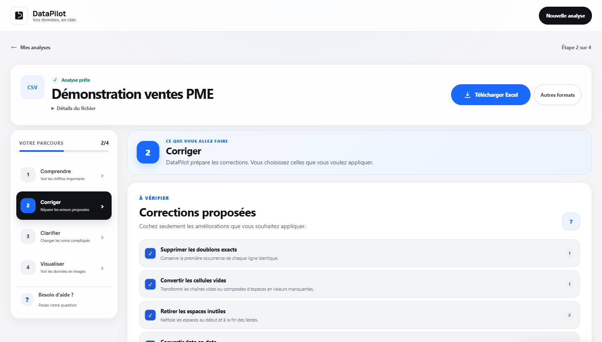

# DataPilot

MVP indépendant de préparation et de compréhension des données pour les PME.

> **En bref :** une application web qui aide une PME à passer de fichiers bruts (CSV, Excel, JSON) à des données exploitables : profilage et score qualité, corrections proposées puis validées par l'utilisateur, tableaux de bord de KPI et exports Excel. **116 tests automatisés.**
>
> **Stack :** Python, Pandas, Flask, Celery, Redis, Docker · **Portfolio :** [abdou-salou.github.io](https://abdou-salou.github.io/fr)

| 1. Comprendre : score qualité, lignes, cellules vides, doublons | 2. Corriger : corrections proposées, appliquées seulement si cochées |
|---|---|
|  |  |

*Captures réalisées avec le fichier de démonstration `demo/ventes_pme.csv`.*

## Fonctions disponibles

- import local CSV, Excel et JSON ;
- traitement des imports en arrière-plan avec Celery et Redis, avec repli local si la file est indisponible ;
- limite de 20 Mo, 100 000 lignes et 200 colonnes ;
- profilage : types, valeurs manquantes, doublons et score qualité ;
- suggestions de nettoyage validées manuellement ;
- corrections cumulatives, annulables et enregistrables comme modèles ;
- dashboard automatique selon les types de colonnes ;
- graphiques créés depuis une question puis ajoutés à l'espace Graphiques ;
- explication descriptive du point le plus élevé et tableau accessible des valeurs ;
- chiffres métier suivis par rapport à un objectif ;
- renommage réversible des colonnes et catégories dans toute langue, appliqué à l’aperçu, aux graphiques, à l’assistant et aux exports sans modifier le fichier source ;
- suggestion locale et éditable de titres lisibles, sans transmission du contenu du fichier ;
- dictionnaire métier rétrocompatible français/arabe utilisé par l'assistant ;
- import local de factures PDF et photos avec confirmation humaine ;
- exports CSV et Excel neutralisant les formules tableur potentielles ;
- couche sémantique générée dans `storage/<projet>/semantic.json` ;
- assistant local en lecture seule pour les questions contrôlées ;
- assistant Groq optionnel pour expliquer les tendances, limites et pistes d'action.

Le mode local ne transmet rien. Le mode Groq n'envoie jamais les lignes du fichier :
seuls la question, les noms de colonnes, les statistiques agrégées, les distributions
à faible cardinalité non sensibles et les corrélations sont transmis.

## Lancer

Pour le mode robuste recommandé, démarrez Docker Desktop puis double-cliquez sur
`lancer_datapilot_robuste.bat`. Cette commande démarre Redis, un worker Celery et
l’application. Utilisez `arreter_datapilot_robuste.bat` pour arrêter proprement
les trois services.

Le mode local avec repli automatique reste disponible via `lancer_datapilot.bat`, ou :

```powershell
pip install -r requirements.txt
python app.py
```

Puis ouvrir `http://localhost:5071`.

### Services Redis et Celery

```powershell
docker compose up -d redis
python -m celery -A task_queue.celery_app worker --loglevel=INFO --pool=solo
python app.py
```

Sur Linux ou macOS, vous pouvez retirer `--pool=solo`. La configuration utilise
`DATAPILOT_REDIS_URL` si cette variable est définie, sinon
`redis://127.0.0.1:6379/0`. L’état des services est disponible sur `/health`.

Si Redis ou le worker ne répond pas au moment d’un import, DataPilot effectue
l’analyse dans le processus web. Un bouton de repli local est aussi proposé sur
l’écran d’attente, afin qu’un incident de file ne bloque jamais un fichier.

## Activer la réponse approfondie facultative

1. Créez une clé dans la console Groq.
2. Définissez la variable d'environnement `GROQ_API_KEY` sans placer la clé dans le code :

```powershell
$env:GROQ_API_KEY = "votre-cle-groq"
python app.py
```

Pour la rendre disponible aux prochains lancements Windows, utilisez les paramètres
« Variables d'environnement » de votre compte utilisateur. Le modèle par défaut est
`openai/gpt-oss-20b`. Vous pouvez le remplacer avec `GROQ_MODEL`.

La clé n'est ni affichée dans l'interface, ni écrite dans les projets ou les journaux.

Pour une première démonstration, importez `demo/ventes_pme.csv` : il contient
des espaces inutiles, une valeur manquante, un doublon et des nombres utilisant
la virgule décimale.

## Tests

```powershell
pip install -r requirements-dev.txt
pytest -q
```

## Architecture IA

Groq reçoit un contrat d'analyse structuré et renvoie un JSON conforme à un schéma
strict. DataPilot valide et présente la réponse, les points clés, les limites et des
questions complémentaires. Tous les calculs restent en lecture seule.
